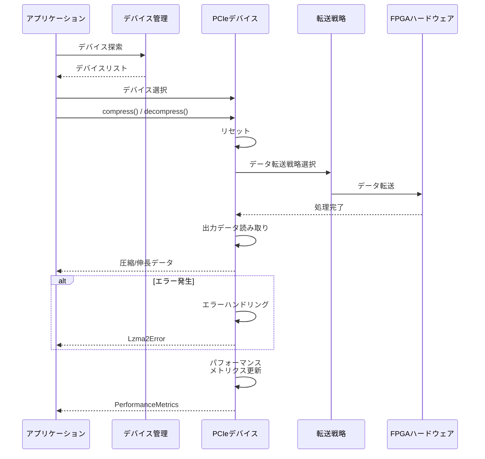

```mermaid
sequenceDiagram
    participant App as アプリケーション
    participant DevMgr as デバイス管理
    participant Device as PCIeデバイス
    participant Transfer as 転送戦略
    participant HW as FPGAハードウェア

    App->>DevMgr: デバイス探索
    DevMgr-->>App: デバイスリスト
    App->>Device: デバイス選択

    App->>Device: compress() / decompress()
    Device->>Device: リセット
    Device->>Transfer: データ転送戦略選択
    Transfer->>HW: データ転送

    HW-->>Device: 処理完了
    Device->>Device: 出力データ読み取り
    Device-->>App: 圧縮/伸長データ

    alt エラー発生
        Device->>Device: エラーハンドリング
        Device-->>App: Lzma2Error
    end

    Device->>Device: パフォーマンス<br>メトリクス更新
    Device-->>App: PerformanceMetrics
```
